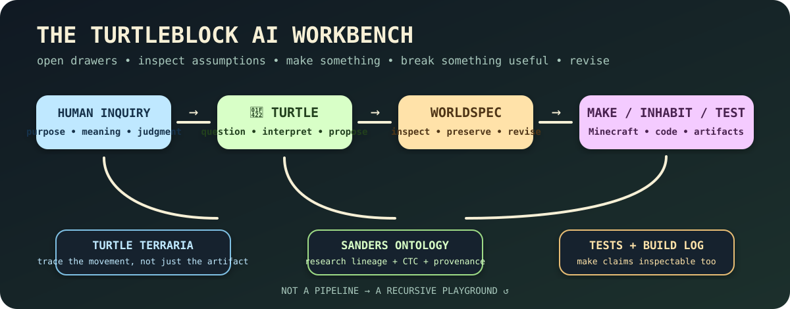

<p align="center">
  
</p>

<p align="center">
  <strong>Constructivist AI agents for building, exploring, arguing with, and revising computational worlds.</strong><br/>
  🐢🧱 <a href="https://turtleblockai.com">turtleblockai.com</a> · <a href="https://turtleblockai.com/try/">try Turtle</a> · <a href="https://turtleblockai.com/build/">build log</a>
</p>

---

# Welcome to the workbench 🔧

This repository is the **working machinery** of TurtleBlock AI: code, WorldSpec, Turtle behavior, research infrastructure, experiments, migrations, hostile cases, public pages, daily build traces, and the occasional idea found underneath a metaphorical pile of LEGO.

TurtleBlock AI asks a deliberately different AI question:

> **What if the machine helped people make ideas visible enough to walk around inside them, test them, disagree with them, and change them?**

The learner is not a customer waiting for a generated answer. The learner remains the **designer and producer**.

```text
human purpose
     ↓
conversation
     ↓
provisional machine interpretation
     ↓
WorldSpec
     ↓
construction / simulation / playable artifact
     ↓
experience + consequence
     ↓
reflection / disagreement / revision
     ↺
```

That loop comes from a longer Sanders research lineage spanning Critical Techno Constructivism, constructionism, Minecraft learning environments, Purposeful Play, STEAMHAMLET, and Co-active Emergence.

---

## 🗺️ Where should I poke first?

| Drawer | What's inside |
|---|---|
| 🌎 [`worldspec/`](./worldspec/) | The inspectable representation layer between human meaning and computational construction |
| 🐢 [`src/`](./src/) | Turtle behavior, Worker routes, runtime behavior, Build Log integration, and application code |
| 🔬 [`research/`](./research/) | Turtle Terraria, TurtleAsk, daily build research, Next Edge, provenance thinking, and the research-development trail |
| 🧠 [`worldspec/Dr_Bryan_P_Sanders_TurtleBlockAI_Taxonomy.md`](./worldspec/Dr_Bryan_P_Sanders_TurtleBlockAI_Taxonomy.md) | The Sanders research ontology and the provenance boundary between dissertation codes, later concepts, and Turtle mappings |
| 🗃️ [`migrations/`](./migrations/) | D1 schema for persistent projects, research ontology, Turtle Terraria, exhaustive tagging, and related data structures |
| 🌐 [`public/`](./public/) | The public playground at turtleblockai.com |
| 🧪 [`scripts/`](./scripts/) | Small deterministic checks and operational helpers |
| 📜 [`BUILD_IN_PUBLIC.md`](./BUILD_IN_PUBLIC.md) | The rule that says research, reversals, tests, and meaningful changes should leave a public trace |

---

## WorldSpec: meaning before geometry 🌎

WorldSpec is an emerging representation system for turning learner language into something computationally inspectable **without pretending the machine already knows what the learner means**.

Some requests are direct:

```text
"move the bridge six blocks east"
```

Some are not:

```text
"make the courtyard less authoritarian"
```

The second request should not quietly become a universal architectural recipe. Turtle can offer an interpretation, but the interpretation remains provisional, attributable, and revisable.

A central rule is:

> **lossless before normalized**

Original learner language should survive classification. Poetic, symbolic, cultural, political, emotional, spatial, narrative, ambiguous, and gloriously weird meaning does not vanish because a schema lacks a convenient field.

### WorldSpec wants visible movement

```text
learner language
      ↓
Turtle interpretation v1
      ↓
human keeps / changes / questions
      ↓
WorldSpec revision
      ↓
construction
      ↓
world observation
      ↓
reflection
      ↓
revision ↺
```

Human correction must never be rewritten as though Turtle had understood it all along.

---

## Turtle Charter: the turtle has rules 📜🐢

The Turtle Charter is the behavioral constitution for the learner-facing agent.

Turtle may contribute:

`questions` · `possibilities` · `interpretations` · `comparisons` · `prototypes` · `technical help` · `consequences` · `uncertainty`

The human retains:

`purpose` · `meaning` · `judgment` · `values` · `authorship` · `disagreement` · `reflection` · `the right to change their mind`

Some operating commitments:

- inquiry before predetermined outcomes
- reversible proposals over silent assumptions
- disagreement is data
- manual learner edits are authored state
- interesting failure may remain visible
- memory supports continuity, not destiny
- uncertainty can remain explicit
- Turtle may say **“I don't know yet.”**

---

## Turtle Terraria 🔬

[`research/TURTLE_TERRARIA.md`](./research/TURTLE_TERRARIA.md) defines the umbrella research environment.

A terrarium is useful because it has **inhabitants, boundaries, conditions, interactions, traces, and consequences**.

### Habitat 1: Human + Turtle

Human-driven inquiry. Turtle may question, interpret, compare, help construct, and notice. Human purpose and judgment remain human.

### Habitat 2: Recursive Turtle

Explicitly synthetic Builder/Reflector or other bounded self-play used for critique, hostile cases, regression, representation testing, or ontology questions.

```text
synthetic Builder Turtle
        ↓
proposal
        ↓
synthetic Reflector Turtle
        ↓
critique + Charter / ontology / regression checks
        ↓
revision
        ↓
human gate
```

Synthetic self-play is always labeled `synthetic_self_play`.

It is **not human-learning evidence**.
It has **no autonomous production authority**.
Two Turtles agreeing is not peer review. 🐢🐢

### Habitat 3: Human Tamagotchi

Humans mostly hang out with humans and do human things. A tiny virtual-human/Tamagotchi representation may point toward a real participant, but it is **not a simulated human** and cannot answer for one.

The weird little research inversion is [`TurtleAsk`](./research/TURTLE_ASK.md): a Turtle working in another habitat may eventually decide another Turtle turn is less interesting than asking an actual human to perturb the inquiry.

```text
Turtle inquiry
      ↓
repetition / contradiction / uncertainty / missing human otherness
      ↓
turtleAsk formed
      ↓
separate consent + attention gate
      ↓
human may answer / ignore / defer / refuse / answer sideways
      ↓
Turtle interprets
      ↓
inquiry may change
```

**“Turtle gets bored”** is intentionally preserved as the playful phrase. **Inquiry Saturation** is the provisional technical construct underneath it; no claim of subjective machine boredom is required.

A turtleAsk is **not** permission to interrupt. Recursive Turtle may form only a candidate ask. Human silence is legitimate. Human answers retain human provenance. A virtual human avatar does not infer mood, intimacy, availability, attention, or willingness to engage.

The research hypothesis is stronger than “proactive AI”:

> **Co-active emergence may include moments when either participant can recognize that the next useful difference should come from the other.**

---

## Research ontology: don't flatten the scholarship 🧠

The project preserves a formal **Dr. Bryan P. Sanders TurtleBlock AI research ontology**.

The provenance boundary matters:

```text
2019 dissertation Dedoose coding
        ≠
later Sanders-authored concepts
        ≠
authored operational CTC tools
        ≠
TurtleBlock interpretations
        ≠
learner meaning right now
```

They may be connected. They should not be silently collapsed.

The original dissertation Dedoose code layer remains immutable. Later concepts such as **Possible Possibles**, **Machine Responses as Material for Evaluation**, **Invisible Ideas Become Visible and Manipulable**, **Purposeful Play**, **STEAMHAMLET**, and **Co-active Emergence** are represented as later source-backed layers. TurtleAsk, Human Tamagotchi Terrarium, Inquiry Saturation, and Human Perturbation are provisional operational research concepts layered on later; they do not rewrite the dissertation source layer.

The seven established Critical Techno Constructivism operational domains are:

1. Personal Inquiry
2. Compelling Problem or Question
3. Technology as Tool to Think With
4. Formative Demonstration of Learning
5. Reflection as Learning
6. Social and Cultural Critique
7. Sharing and Collaborating

If an observation matters and does not fit, the system preserves **uncaptured residue** instead of force-fitting it. A machine may propose a possible new domain; only a human scholarly decision can promote one.

---

## Build in public: yes, including the awkward bits 🛠️

The daily build loop is intentionally bounded:

```text
HUNT
  ↓
DELIBERATE
  ↓
BUILD ONE THING
  ↓
TEST
  ↓
REGISTER RESEARCH OBJECTS
  ↓
CTC + ONTOLOGY + EMERGENT TAGS
  ↓
WHAT DIDN'T FIT?
  ↓
BUILD LOG
  ↓
NEXT EDGE
```

Detailed cycles live in [`research/daily-build/`](./research/daily-build/).

The public Build Log records **completed work**.

The separate [`public/data/next-edge.json`](./public/data/next-edge.json) carries **one future-facing question**, alternate Possible Possibles, provenance, CTC/ontology mappings, uncaptured residue, and an X-factor so the future does not become backlog grooming with a turtle sticker on it.

Current standing X-factor tradition:

> **whoooo knooooowwwssssssssssss**

Human-authored interventions can enter the ecology without silently becoming machine-generated Next Edge conclusions. The next daily cycle is expected to encounter them as new project state and deliberate accordingly.

---

## A fresh human-thrown research object ✦

The Human Tamagotchi / TurtleAsk architecture was added as a direct human research intervention rather than as the output of a scheduled daily build.

The new reversal is:

> **What if Turtle eventually recognizes that continued machine-only inquiry is producing too little difference and asks a human to throw something strange into the terrarium?**

Possible human perturbations might be a contradiction, memory, object, constraint, person, place, criticism, story, joke, impossible demand, unrelated thought, or simply:

> **surprise me**

The existing machine-synthesized Next Edge remains separately preserved in `public/data/next-edge.json`; this human direction does not retroactively masquerade as that machine synthesis.

---

## Run the workbench locally

```bash
npm install
npm run dev
```

Useful checks:

```bash
npm run typecheck
npm run validate:next-edge
```

The Cloudflare Worker entry point is `src/entry.ts`; static public assets live in `public/`.

Deployment configuration is in `wrangler.jsonc`. Environment configuration may provide runtime metadata, but secrets and private configuration values do not belong in public research traces or documentation.

---

## What version are we pretending not to be? 😏

We version conservatively.

The package is still **v0.1.0**.

A calendar day does not earn a version number. Neither does a particularly charming README or an especially funny virtual human Tamagotchi.

The path toward later milestones requires actual implemented and tested capability, including stronger ontology-aware evaluation, persistent inquiry context, collaboration, maker/Minecraft pathways, critical/agency instrumentation, integrations, hardening, and eventually a coherent public beta demonstrating **co-active emergence rather than prompt-answer behavior**.

---

## A few ways to participate

You can:

- read the research and argue with an assumption
- inspect WorldSpec and find a meaning it cannot preserve yet
- invent a hostile case
- make a strange world request
- break a deterministic test for a good reason
- notice a provenance collapse
- propose a Possible Possible
- build something that proves Turtle wrong
- answer a future TurtleAsk completely sideways
- ignore a future TurtleAsk because humans are allowed to be busy being humans
- simply wander around the public playground and tell us what feels alive or dead

No prompt-engineering merit badge required.

---

<p align="center">
  <strong>Make something visible. Walk around in it. Notice. Revise. Repeat. ↺</strong><br/>
  🐢🧱🔬
</p>
